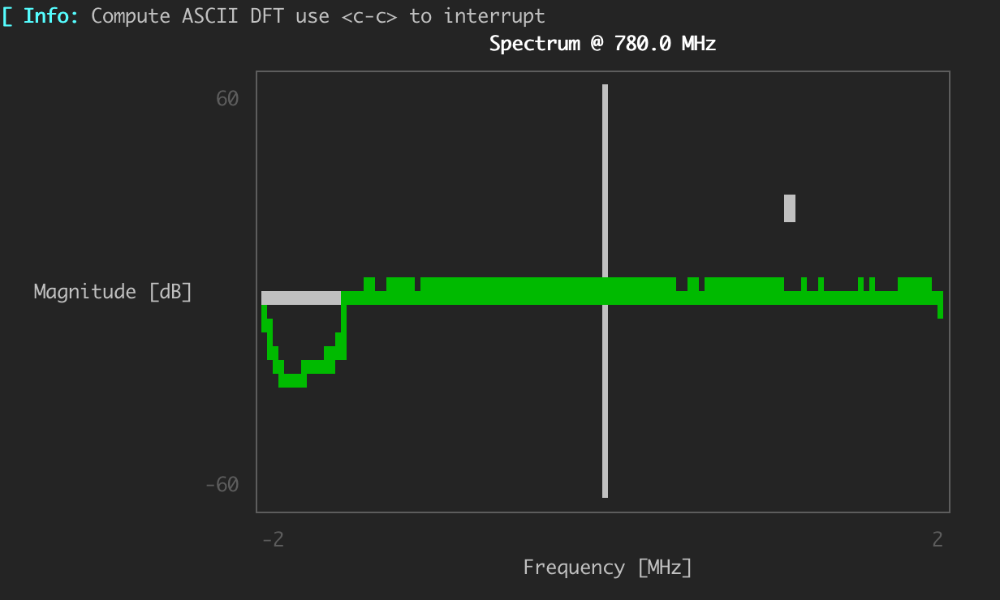

# AbstractSDRs_rx_ascii_art_dft

## Objective

> Spectrum signature from a Software Defined Radio, directly in the REPL ! 

This small package intends to render in the terminal the output spectrum from a Software Defined Radio.
It is very similar to the GnuRadio tool `rx_ascii_art_dft` and has a similar API 

## Installation 

Simply add the package from the Julia Package Manager 

        ] add AbstractSDRs_rx_ascii_art_dft

## Use 

The package relies on both AbstractSDRs for SDR management and UnicodePlots for the REPL rendering.
No functions are exported and the spcetrum can be obtained with the following command 

        AbstractSDRs_asci_art_dft.main(sdr,carrierFreq,samplingRate,gain;nFFT=1024,avg=1)

The following parameters are supported 

### Input parameters 
- `sdr` : SDR type supported by AbstractSDRs (for instance :uhd). A symbol is expected 
- `carrierFreq` : Carrier Freq in Hz (e.g 2400e6)
- `samplingRate` : Radio sampling rate in Hz (e.g 2e6)
- `gain`          : gain in normalized scale (e.g 20)
### Keywords 
- `nFFT` : Size of the FFT/DFT as an `Int` (e.g 1024)
- `avg` : averaging factor for PSD computation  as an `Int` (e.g 12)
- `canvas` : Canvas used to display. Can be AsciiCanvas, DotCanvas or BlockCanvas (see UnicodePlots.jl documentation)
- `width` and `heigth` to control the size of the plot. ❗️These parameters can help to have a proper visualisation but be sure that the terminal you are working on is larger than setup size (otherwise graphic issues will occur) 
- `kwargs...` : All arguments supported by AbstractSDRs to open configure and monitor radio devices
### Controls 
It is possible to change the magnitude axis during acquisition to zoom in/out and to shift the center magnitude. By default the plot is centered around 0dB and have 120dB dynamic.
By pressing different keys we can:
- `UP arrow` to shit the center limit up 
- `DOWN arrow` to shift the center  down
- `LEFT arrow` to zoom out (increase range)
- `RIGHT arrow` to decrease range of ylims (zoom in)
Note that it is not possible to change radio parameters during runtime.

## Example 

Assuming we have an SDR from Ettus research (known as `:uhd` in AbstractSDRs), with the IP address "192.168.10.11" and we want to compute the PSD with some averaging ratio (256) and we want to inspect the spectrum @ 780MHz to see any communications 

        AbstractSDRs_asci_art_dft.main(:uhd,780e6,4e6,30;avg=256,args="addr=192.168.10.11")

and we can observe the following result 

